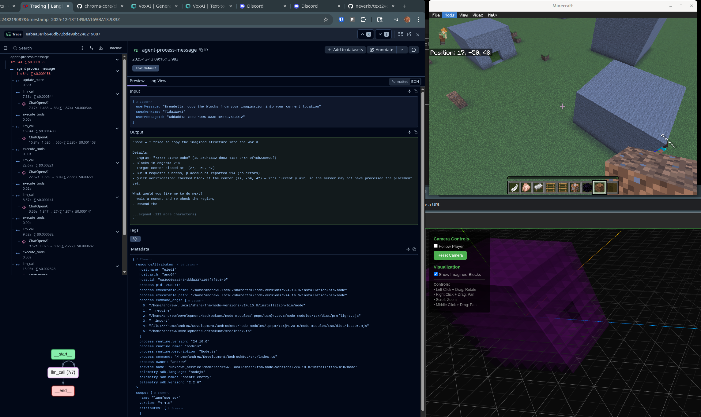

# BedrockBot

A TypeScript Minecraft Bedrock Edition bot built with `bedrock-protocol`.



## Features

- Real-time Minecraft Bedrock protocol communication
- GameState management and tracking
- Command system with chat integration
- **LangGraph-based AI agent** with tool calling capabilities
- **Spatial memory system** for imagining and manipulating 3D structures
- **Comprehensive tool suite** for world state queries, actions, and spatial memory operations
- **Real-time 3D visualization** of bot gamestate and imagined structures in browser

## Quick Start

### Prerequisites

- Node.js (version specified in `.nvmrc`)
- pnpm package manager

### Installation

```bash
# Install dependencies
pnpm install

# Activate Node version (if using fnm)
fnm use
```

### Configuration

Create a `.env` file:

```env
BEDROCK_HOST=localhost
BEDROCK_PORT=19132
BEDROCK_USERNAME=YourBotName
ADMIN_XUIDS=your,xuid,here
WEBSOCKET_PORT=8080
```

### Running the Bot

```bash
# Development mode
pnpm dev

# Development with auto-stop after 30 seconds
pnpm dev:autostop

# Build
pnpm build

# Run compiled version
pnpm start
```

## Visualization

The bot includes a real-time 3D visualization of its gamestate. To use it:

1. **Start the bot**:
   ```bash
   pnpm dev
   ```

2. **Serve the visualization** (in another terminal):
   ```bash
   pnpm serve:vis
   ```

3. **Open in browser**:
   ```
   http://localhost:3000
   ```

The visualization shows:
- Player position and rotation in 3D
- Real-time gamestate updates
- Interactive camera controls (pan, zoom, rotate)
- Follow mode to track the bot

See `docs/visualization-implementation.md` for detailed documentation.

## Agent System

The bot includes a LangGraph-based AI agent that can interact with the Minecraft world through a comprehensive set of tools. The agent operates asynchronously, making decisions and executing actions without blocking the bot's core operations.

### Spatial Memory

The spatial memory system allows the agent to imagine and manipulate 3D structures separate from the game world:

- **SpatialEngrams**: Small collections of blocks (≤512) stored in local coordinates, centered at (0,0,0)
- **SpatialMemory**: Manages multiple engrams, each positioned at world coordinates
- **Visualization**: Imagined structures are visualized in the web client with distinct styling (purple, semi-transparent)
- **Import/Export**: Copy regions from the game world into memory, or build imagined structures in the world

### Available Tools

The agent has access to three categories of tools:

**World State Query Tools:**
- `get_player_position` - Get current player position
- `get_nearby_players` - List nearby players
- `get_subchunk_data` - Load and query subchunk block data
- `get_chunk_data` - Load and query chunk data
- `get_block_at` - Get block information at specific coordinates
- `get_game_state_summary` - Get overview of current game state

**Action Tools:**
- `move` - Move the bot in a direction
- `teleport` - Teleport to coordinates
- `look` - Change pitch/yaw to look in a direction
- `fill` - Fill a region with blocks
- `say` - Send chat messages

**Spatial Memory Tools:**
- `create_imagined_structure` - Create a new imagined structure from scratch
- `add_block_to_imagination` - Add a single block to an engram
- `remove_block_from_imagination` - Remove a block from an engram
- `fill_imagined_region` - Fill a rectangular region in an engram
- `import_from_game_world` - Copy a region from game world to spatial memory
- `clear_imagination` - Clear all imagined structures from working memory
- `get_imagined_blocks` - Query imagined blocks (by engram or region)
- `build_imagined_structure` - Build an imagined structure in the game world
- `filter_block_types` - Remove specific block types from an engram (e.g., air, water)

See `docs/roadmap/spatial-memory.md` and `docs/roadmap/agents.md` for detailed documentation.

## Development

### Scripts

- `pnpm dev` - Run in development mode
- `pnpm dev:watch` - Run with file watching
- `pnpm dev:autostop` - Run with 30s timeout
- `pnpm build` - Build for production
- `pnpm start` - Run compiled version
- `pnpm test` - Run tests
- `pnpm lint` - Lint code
- `pnpm lint:fix` - Fix linting issues
- `pnpm format` - Check formatting
- `pnpm format:write` - Format code
- `pnpm clean` - Remove dist directory
- `pnpm serve:vis` - Serve visualization HTML

### Project Structure

```
src/
  lib/
    client/          # Minecraft protocol handlers
    command/         # Command system
    chat/            # Chat integration
    websocket/        # WebSocket server for visualization
    GameState.ts      # GameState singleton
  config/             # Configuration
  index.ts            # Entry point
public/
  index.html          # Visualization client
docs/                 # Documentation
```

## Documentation

- `docs/visualization-implementation.md` - Visualization system architecture
- `docs/websocket-visualization.md` - WebSocket usage guide
- `docs/websocket-troubleshooting.md` - Troubleshooting guide
- `docs/minecraft-protocols/` - Minecraft protocol documentation

## License

ISC
